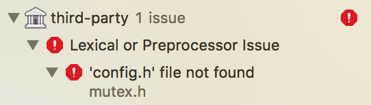
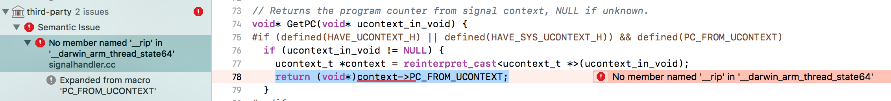
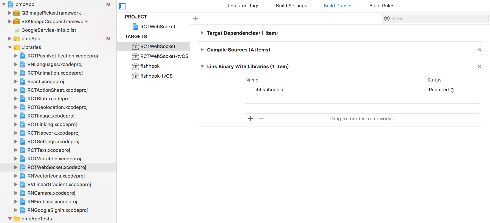
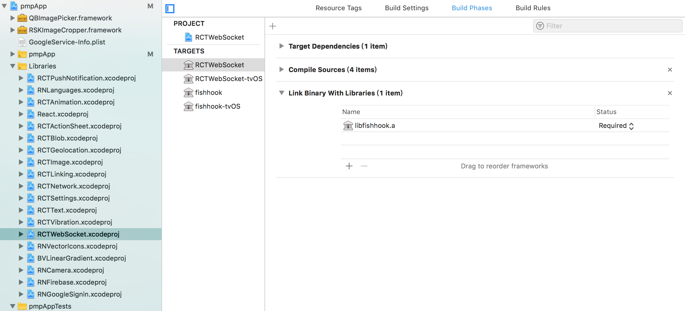
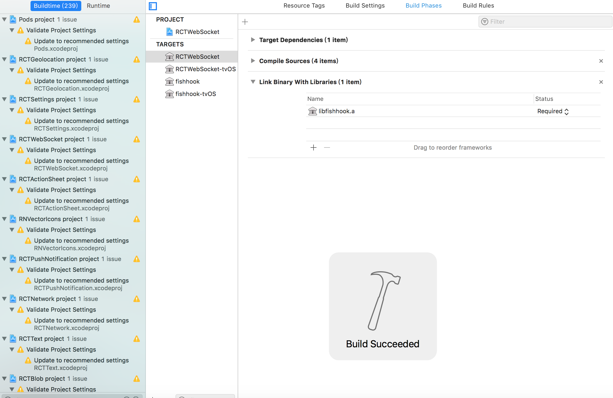

## Description
When I ran my iOS app on a real device, Xcode showed `Build failed` and the error:
~~~
third-party: 'config.h' file not found
~~~
<figure class="half">
	
	<figcaption>error picture</figcaption>
</figure>

## Environment
- Xcode: 10.1

~~~
"dependencies": {
    "base-64": "^0.1.0",
    "crypto-js": "^3.1.9-1",
    "i18next": "^11.3.2",
    "lodash": "^4.17.11",
    "native-base": "^2.6.1",
    "react": "^16.5.0",
    "react-i18next": "^7.6.1",
    "react-native": "0.55.3",
    "react-native-camera": "^1.0.2",
    "react-native-check-box": "^2.1.0",
    "react-native-firebase": "^4.0.5",
    "react-native-google-signin": "^0.12.0",
    "react-native-hyperlink": "0.0.14",
    "react-native-icon-badge": "^1.1.3",
    "react-native-image-crop-picker": "^0.20.3",
    "react-native-image-zoom-viewer": "^2.2.19",
    "react-native-languages": "^2.0.0",
    "react-native-linear-gradient": "^2.4.0",
    "react-native-push-notification": "^3.1.2",
    "react-native-qrcode": "^0.2.6",
    "react-native-qrcode-scanner": "0.0.30",
    "react-native-snap-carousel": "^3.7.5",
    "react-native-vector-icons": "^4.6.0",
    "react-navigation": "^1.4.0"
  }
~~~

## What I've Tried
~~~
rm -rf node_modules && yarn cache clean && yarn install
~~~
It didn't work for me at all.

## Solution
~~~
rm -rf node_modules/ && yarn cache clean && yarn install

node_modules/react-native/scripts/ios-install-third-party.sh

cd node_modules/react-native/third-party/glog-0.3.4

./configure
~~~
!! **replace glog-0.3.4 with yours**

Do `Clean Build Folder` and `Run` in Xcode.

Find the line with blue background color below, replace `return (void*)context->PC_FROM_UCONTEXT;` with `return NULL;`.
<figure>
	
    <figcaption></figcaption>
</figure>

Open `RCTWebSocket.xcodeproj` under `/<YourApp>/Libraries/`, remove `libfishhook.a` and add it again.
<figure>
	
	<figcaption>Before removing</figcaption>
</figure>
<figure>
	
	<figcaption>After adding it again</figcaption>
</figure>

Build Succeeded! 
<figure>
	
	<figcaption></figcaption>
</figure>

## Reference
* <https://github.com/facebook/react-native/issues/19529#issuecomment-423898864>