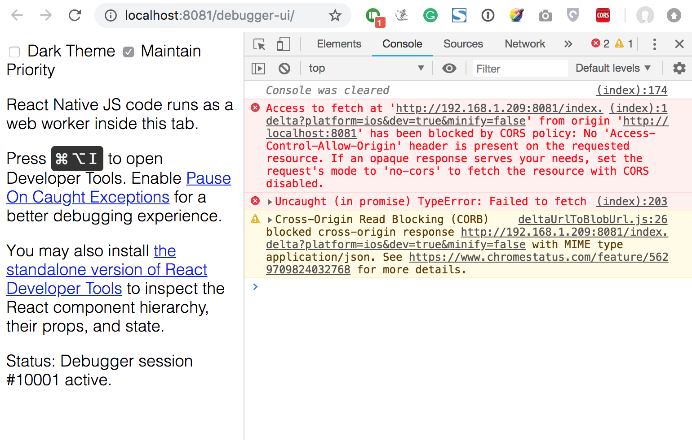

## Description
I run my iOS app on a real device, everything works fine. Once I shake my device and click `Debug JS Remotely`, 
black screen shows up like this:  
<figure class="third">
	
	<figcaption></figcaption>
</figure>

The following message shows on the console of Chrome: 
<figure>
	
	<figcaption></figcaption>
</figure>
Only when I stop debugging JS remotely do the app work fine again.

## What I've Tried

Install ["Allow-Control-Allow-Origin" plugin](<https://chrome.google.com/webstore/detail/allow-cors-access-control/lhobafahddgcelffkeicbaginigeejlf> "Click") on Chrome and reload the app.
It works for some people except me, I've got another error...surprise!

## Solution

Make sure that your PC and device are connected to the same Wi-Fi network.
In the browser address bar, change url from 

**localhost:8081/debugger-ui**

to 

**http://\<your-pc-ip\>:8081/debugger-ui**

e.g. mine is http://192.168.1.209:8081/debugger-ui