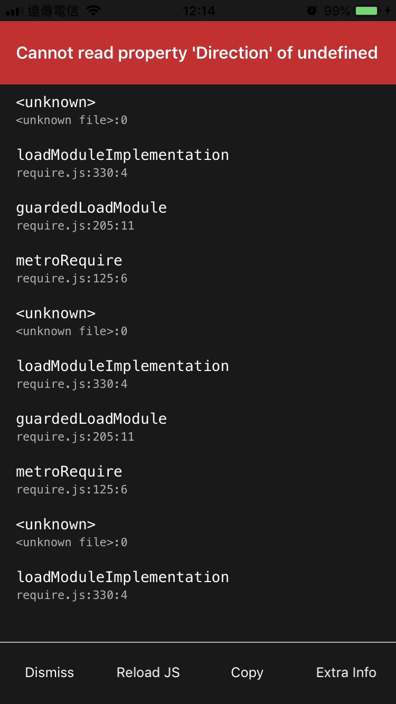
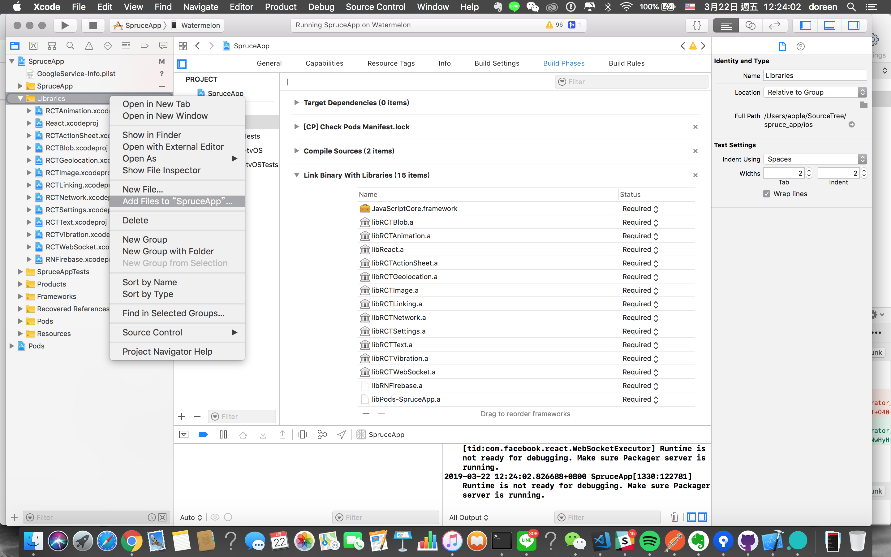
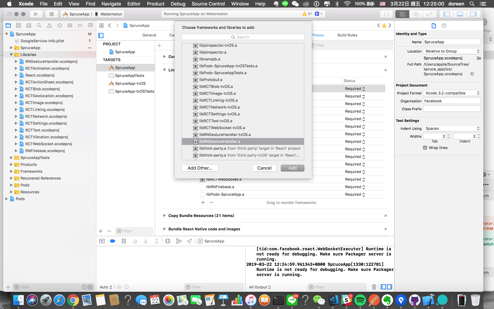

## Description
According to [reactnavigation.org](https://reactnavigation.org/docs/en/getting-started.html), I installed both `react-navigation` and `react-native-gesture-handler`.

```shell_session
npm install react-navigation --save
react-native link react-navigation

npm install react-native-gesture-handler
react-native link react-native-gesture-handler
```

I got this after running on a real device:
<figure class="half">
	
    <figcaption></figcaption>
</figure>

## Solution
1. Open Xcode and right click Libraries "Add Files to Project"
    <figure>
        
        <figcaption></figcaption>
    </figure>
2. /node_modules/react-native-gesture-handlers/ios/RNGestureHandler.xcodeproj
3. Go to build phases and add "libRNGestureHandler.a"
    <figure>
        
        <figcaption></figcaption>
    </figure>
4. Run