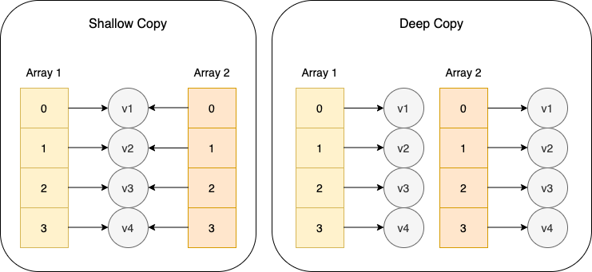

## 什麼是拷貝（Copy）？

拷貝（Copy）就是以相同的值（value）去初始化一個新的變數（variable）。

```js
const amyLoc = "East"; // Amy在東邊
let frankLoc = amyLoc; // Amy的男友Frank和她在一起也在東邊

console.log(amyLoc); // East
console.log(frankLoc); // East
```
這裡 `frankLoc` 是 `amyLoc` 的拷貝。

講淺拷貝（Shallow Copy）和深拷貝（Deep Copy）的差異前，要先了解JavaScript的資料型別（data types）。

---

## JavaScript的資料型別（data types）
JavaScript的資料型別主要分為兩大類型：原始值（Primitive） ＆ 物件（Object）。

- 原始值（Primitive）：Number, string, boolean, null, undefined, symbol（於ES6定義）
- 物件（Object）：Object, array, function, date, regx...

基本上除了原始值以外的都可以歸類到物件裡。

它們兩者最大的差別之一就是傳值的方式，這直接導致了進行拷貝時會出現的問題。

- 原始值（Primitive)：**傳值（pass-by-value）**
- 物件（Object）：**傳址（pass-by-reference）**

### 原始值（Primitive)：傳值（pass-by-value）
```js
let amyLoc = "Restaurant"; // Amy在餐廳
let frankLoc = amyLoc; // Amy的男友Frank和她在一起也在餐廳

frankLoc = "Seaside"; // Amy向男友Frank提了分手以後，Frank傷心地跑去了海邊

console.log(amyLoc); // Restaurant
console.log(frankLoc); // Seaside
```
由於傳的是值，當`frankLoc`的值改變時，`amyLoc`並不會跟著改變。

### 物件（Object）：傳址（pass-by-reference）
```js
let amy = { status: "In a relationship" }; // Amy原本感情狀態是穩定交往中
let frank = amy; // 在Amy提出分手以前，Frank的的感情狀態和她一樣

frank.status = "Single"; // Frank在被甩了以後變成了單身

console.log(amy.status); // Single
console.log(frank.status); // Single
```
由於傳的是位址，當`frank.status`改變時，實際上是在改變`amy.status`，因為它們根本上就是同一個物件。

這個例子就是所謂的淺拷貝。

---

## 淺拷貝（Shallow Copy）vs 深拷貝（Deep Copy）

理解了 JavaScript 中的資料型別後，理解深淺拷貝就容易得多。

- 淺拷貝（Shallow Copy）
    - 僅拷貝變數的位址
    - 新變數和原變數**共用**一塊記憶體
    - 新變數的修改實際上是對原變數的修改
- 深拷貝（Deep Copy）
    - 拷貝原變數的內容，初始化一個新的但內容完全一樣的變數
    - 新變數和原變數**不共用**記憶體，即記憶體的位址並不相同
    - 新變數和原變數之間互相不影響



---

## 進行拷貝的方法

有一個使用情境，當使用者進入資料編輯頁面後，對他是否修改資料進行判斷：如判斷是，則 enable 更新按鈕；判斷否，則 disable 更新按鈕。以此達到性能優化、減少伺服器多餘負擔的目的。

```js
const frankInfo = {
    "location": "Restaurant"
    "status": "In a relationship",
}

let frankInfoCopied = "?"
```

### 1. 手動拷貝

重新對新變數進行定義。這樣做很繁瑣，一旦資料變多，會寫到往生，所以大部分情況下不會這麼寫。只有在資料量極小，並且確定不會有多層時，才有可能有機會用到。
```js
const frankInfo = {
    "location": "Restaurant"
    "status": "In a relationship",
}

let frankInfoCopied = {
    "location": frankInfo.location,
    "status": frankInfo.status
}
frankInfoCopied.status = "Single";

console.log(frankInfoCopied);
// {location: "Restaurant", "status": "Single"}

console.log(frankInfo);
// {location: "Restaurant", "status": "In a relationship"}
```

而且這種做法會有一個問題，當下一層也是 Object 的時候，拷貝的又是位址了。
```js
const frankInfo = {
    "location": "Restaurant",
    "status": "In a relationship",
    "contact": { "home": "123456" }
}

let frankInfoCopied = {
    "location": frankInfo.location,
    "status": frankInfo.status,
    "contact": frankInfo.contact
}
frankInfoCopied.contact.home = "654321";

console.log(frankInfoCopied.contact);
// {home: "654321"}

console.log(frankInfo.contact);
// {home: "654321"} 我們期望 contact.home 不要發生改變，但它還是改變了
```

### 2. 使用 Object.assign()

由 ES6 提供的語法，主要目的用來複製或合併物件。此方法是淺拷貝，只能拷貝到第一層，第一層以後的層數拷貝的都是位址。可以在確定資料只有一層的時候使用。

```js
const frankInfo = {
    "location": "Restaurant",
    "status": "In a relationship",
    "contact": { "home": "123456" }
}

let frankInfoCopied = Object({}, frankInfo)

frankInfoCopied.status = "Single";
frankInfoCopied.contact.home = "654321";

console.log(frankInfoCopied);
// {location: "Restaurant", status: "Single", contact: {home: "654321"}}
// 可以看見 status 和 contact.home 都有作出相應的改變

console.log(frankInfo);
// {location: "Restaurant", status: "In a relationship", contact: {home: "654321"}}
// 位於第一層的 status 維持原樣，然而位於第二層的 contact.home 卻發生改變，這不是我們要的結果
```

### 3. 使用展開運算符（Spread syntax）(...)

由 ES6 提供的語法。此方法是淺拷貝，用於拷貝時的效果同上述的 `Object.assign()`。

### 4. 使用 JSON.parse(JSON.stringify())

這是一種我個人很常用，屬於投機取巧的方法。先將物件轉換成字串，再轉換回物件，在一定條件下可以達到深拷貝的效果。

它的限制是僅能針對 JSON-safe 物件－－即能夠被序列化成字串、同時又能以相同的結構和值被轉換成物件的資料。
包含：數字（Number）、字串（String）、布林值（Boolean）、物件（Object）、陣列（Array）以及 null。

```js
const frankInfo = {
    "location": "Restaurant",
    "status": "In a relationship",
    "contact": { "home": "123456" }
}

let frankInfoCopied = JSON.parse(JSON.stringify(frankInfo))

frankInfoCopied.location = "Seaside";
frankInfoCopied.statue = "Single";
frankInfoCopied.contact.home = "654321";

console.log(frankInfoCopied);
// {location: "Seaside", status: "Single", contact: {home: "654321"}}
// 全部都有作出相應的改變

console.log(frankInfo);
// {location: "Restaurant", status: "In a relationship", contact: {home: "123456"}}
// 全部都維持原來的值
```

### 5. 使用各函式庫提供的方法

僅列出一些常討論的。

* [Lodash](<https://lodash.com/> "Click") - [`clone`](<https://lodash.com/docs/4.17.15#clone> "Click"), [`cloneDeep`](<https://lodash.com/docs/4.17.15#cloneDeep> "Click") 
* [AngularJS](<https://angularjs.org/> "Click") - [`angular.copy`](<https://docs.angularjs.org/api/ng/function/angular.copy> "Click")
* [jQurey](<https://jquery.com/> "Click") - [`jQuery.extend( [true ], target, object1 [, objectN ] )`](<https://api.jquery.com/jquery.extend/> "Click")

---

## Reference
* [MDN Web Docs - Object.assign()](<https://developer.mozilla.org/en-US/docs/Web/JavaScript/Reference/Global_Objects/Object/assign> "Click")
* [What is a JSON-safe object?](<https://stackoverflow.com/questions/46416370/what-is-a-json-safe-object> "Click")
* [What is the most efficient way to deep clone an object in JavaScript?](<https://stackoverflow.com/questions/122102/what-is-the-most-efficient-way-to-deep-clone-an-object-in-javascript> "Click")
* [[Javascript] 關於 JS 中的淺拷貝和深拷貝](<https://larry850806.github.io/2016/09/20/shallow-vs-deep-copy/> "Click")
* [JS-淺拷貝(Shallow Copy) VS 深拷貝(Deep Copy)](<https://kanboo.github.io/2018/01/27/JS-ShallowCopy-DeepCopy/> "Click")
* [JavaScript 進階： Primitive & Object 原始類型與物件的差異](<https://yakimhsu.com/project/project_w17_type_primitive&object.html> "Click")